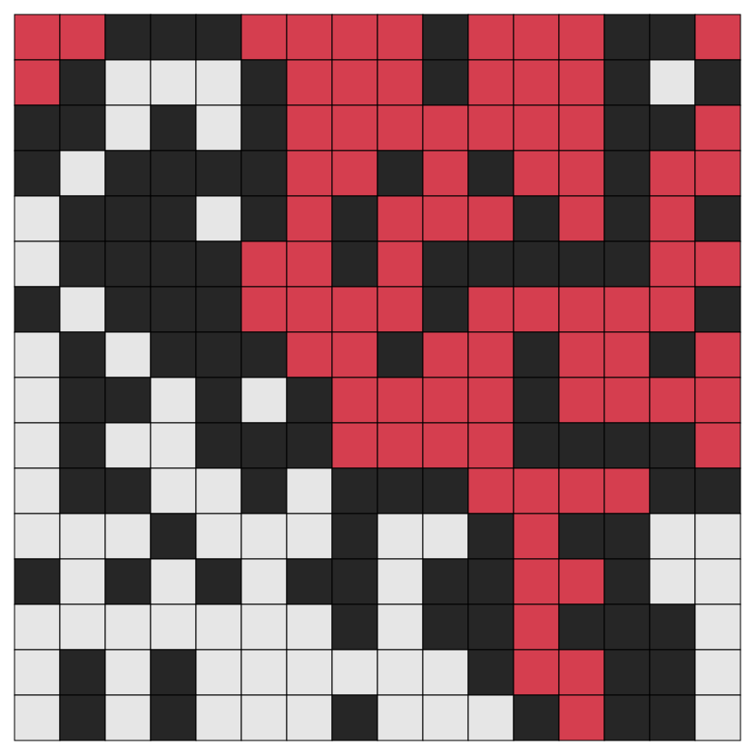

# Percolation
The site percolation code on two dimensional grid

### Description

The code implements [site percolation problem](https://en.wikipedia.org/wiki/Percolation_theory) 
on 2D rectangular grid of cells (or "sites").

A site is "occupied" with probability `p` or "empty" with probability `1 - p`. 
Those probabilities are assumed to be independent for all cells. The question of the problem is: 
for a given `p`, what is the probability that an open path exists between top and bottom?
According to the theory there exists a critical value of `p` below which the percolation probability is always 0 
and above which the probability is always 1. For 2D site percolation the critical value of `p` is close to 0.6.

The program generates a grid of cells for the site vacancy probability `p` and creates a percolation flow
from top to bottom. This makes "open" cells through which the flow propagates "full". 
The output can be visualized by grid image with different colors for "occupied", "empty" and "full" cells.
[Cairo graphics library](https://www.cairographics.org) is used for generation output images in .svg or .png format.

### Compilation and usage

Provided cairo is properly [installed](https://www.cairographics.org/download/) 
the project can be compiled with `makefile` which creates the `percolation` executable.

The program takes 3 mandatory command line arguments:
* grid width
* grid height
* site vacancy probability (floating point value in 0..1 range). 

Optionally one can set the output file paraneters (name and format, maximum image size) and color scheme used.
The output image dimensions are proportional to the grid size, unless an upper limit of image sizes is set
using `--size` option.

By default the output is written to the .png file called `'output_ww_hh_pp.png'` with
the maximum image size of 800px, where `ww` and `hh` are grid width and height respectfully, 
and `pp` is site vacancy probability.

### Command line options

       -w, --width                                   
           grid width (mandatory)                              
                                                     
       -h, --height                                  
           grid height (mandatory)                             
                                                     
       -p, --probability                             
           site vacancy probability (mandatory)            
                                                     
       -o, --output                                  
           output image file (either .png or .svg format)     
                                                     
       -s, --size                                    
           maximum image size (in order to prevent 
           large file generation for large grid sizes)                      
                                                     
       -c, --color                                   
           color for the full sites in form '#rrggbb'
           or as a predefined colors lookup table index                
                                                     
       -l, --list-colors                             
           dispalys a list of predefined colors and  
           their indices (an argument for -c option) 
                                                     
       -r, --recursive                               
           enable recursive flow propagation 
           (might cause stack overflow on large grids)     
                                                     
       -O, --no-output                               
           disable image output                      
                                                     
       --help                                        
           display this help and exit                

### Sample runs

Create a 50x50 grid with site vacancy probability `p = 0.6` and 
save the output image in flow.svg using default color scheme.

`./percolation -w 50 -h 50 -p 0.6 -o flow.svg`

Run recursive flow propagation on 50x50 grid with `p = 0.5`.
The output is written to 'output_50_50_0.5.png'

`./percolation -w 50 -h 50 -p 0.5 --recursive`

Create 4096x4096 grid with `p = 0.65` and save the output to the image flow_large.png.
The output image dimensions are limited to 1024px.

`./percolation --width 4096 --height 4096 --probability 0.65 --size 1024 --output flow_large.png`

Run the flow on 400x200 grid with `p = 0.45` and fill percolated cells with custom color from the colortable.

`./percolation -w 400 -h 200 -p 0.45 -c 2`

Run the flow on 400x200 grid with `p = 0.45` and fill percolated cells with custom color in hex form.

`./percolation -w 400 -h 200 -p 0.45 -c #ff22ee`

### TODO

* [x]     add colors to color map
* [x]     set color from command line
* [x]     parse color ~~both as enum and int~~ as hex
* [x]     make README more complrehensive
* [ ]     add pdf output
* [ ]     include borders to the max image size calculation

### Sample images

